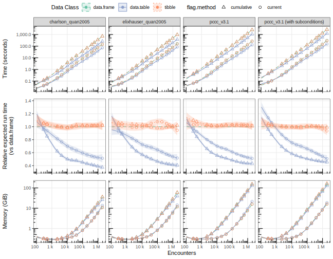

<!-- README.md is generated from README.Rmd. Please edit that file -->

```{r, label = "setup", include = FALSE, echo = FALSE}
knitr::opts_chunk$set(
  collapse = TRUE,
  comment = "#>",
  fig.path = "man/figures/README-"
)
library(kableExtra)
suppressPackageStartupMessages(library(data.table))
```

# Benchmarking `medicalcoder`

The major factors impacting the expected computation time for applying a
comorbidity algorithm to a data set are:

1. Data size: number of subjects/encounters.
2. Data storage class: `medicalcoder` has been built such that no imports of
   other namespaces is required.  That said, when a `data.table` is passed to
   `comorbidities()` and the `data.table` namespace is available, then S3
   dispatch for `merge` is used, along with some other methods, to reduce memory
   use and reduce computation time.
3. flag.method: "current" will take less time than the "cumulative" method.



```{r outtable, include = FALSE}
outtable <- readRDS("outtable.rds")
setDT(outtable)
outtable_orig <- copy(outtable)
outtable[, memory := memory / (1024^2)] # From KiB to GiB

outtable <-
  dcast(
    data = outtable,
    data_class + encounters + method + subconditions ~ flag.method,
    value.var = list("time_seconds", "relative_time", "memory")
  )

neworder <-
  c("method",
    "subconditions",
    "encounters",
    "data_class",
    "time_seconds_current",
    "relative_time_current",
    "memory_current",
    "time_seconds_cumulative",
    "relative_time_cumulative",
    "memory_cumulative"
  )

setcolorder(outtable, neworder = neworder)
outtable[, data_class := factor(data_class, levels = c("data.frame", "data.table", "tibble"))]
setkey(outtable, method, subconditions, encounters, data_class)

outtable[, encounters := qwraps2::frmt(as.integer(encounters))]

outtable[, method := fifelse(subconditions, paste(method, "(with subconditions)"), method)]
outtable[, subconditions := NULL]
```

In general, the expected time to apply a comorbidity method is the same between
`data.frame`s and `tibble`s.  There is a notable decrease in time required when
`data.table`s are passed to `comorbidities()`.  Best observed case: a
`data.table` took
`r outtable_orig[data_class == "data.table", min(relative_time)]`
the time of a `data.frame`.

```{r show-outtable, echo = FALSE, results = "asis"}
foo <- function(x) {
  kbl(
    x = x,
    format = "html",
    escape = FALSE,
    digits = 2,
    align = "ccrrrrrr",
    col.names = c("Encounters", "Data Class", rep(c("Time (seconds)", "Relative time", "Memory (GB)"), times = 2)),
    caption = "Expected time (seconds), relative time (with respect to data.frame), and expected memory use, by flagging method (current or cumulative), number of encounters, and input data storage format."
  ) |>
  collapse_rows(columns = 1, valign = "middle") |>
  row_spec(row = c(seq(1, nrow(x), by = 6)), background = "#D9D9D9") |>
  row_spec(row = c(seq(2, nrow(x), by = 6)), background = "#D9D9D9") |>
  row_spec(row = c(seq(3, nrow(x), by = 6)), background = "#D9D9D9") |>
  add_header_above(c("", "", "flag.method = 'current'" = 3, "flag.method = 'cumulative'" = 3))
}

cat("\n### Benchmarking Charlson (Quan 2005)\n\n")
foo(x = outtable[method == "charlson_quan2005", -"method"])

cat("\n### Benchmarking Elixhauser (Quan 2005)\n\n")
foo(x = outtable[method == "elixhauser_quan2005", -"method"])

cat("\n### Benchmarking PCCC v3.1 (without subconditions)\n\n")
foo(x = outtable[method == "pccc_v3.1", -"method"])

cat("\n### Benchmarking PCCC v3.1 (with subconditions)\n\n")
foo(x = outtable[method == "pccc_v3.1 (with subconditions)", -"method"])
```
