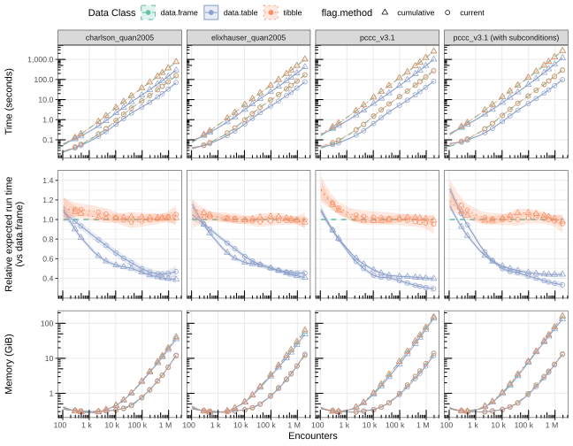

<!-- README.md is generated from README.Rmd. Please edit that file -->

# Benchmarking `medicalcoder`

The major factors impacting the expected computation time for applying a
comorbidity algorithm to a data set are:

1. Data size: number of subjects/encounters.
2. Data storage class: `medicalcoder` has been built such that no imports of
   other namespaces is required.  That said, when a `data.table` is passed to
   `comorbidities()` and the `data.table` namespace is available, then S3
   dispatch for `merge` is used, along with some other methods, to reduce memory
   use and reduce computation time.
3. flag.method: "current" will take less time than the "cumulative" method.

In general, the expected time to apply a comorbidity method is the same between
`data.frame`s and `tibble`s.  There is a notable decrease in time required when
`data.table`s are passed to `comorbidities()`.  Best observed case: a
`data.table` took
0.2911456
the time of a `data.frame`.

### Benchmarking Charlson (Quan 2005)

<table>
<caption>Expected time (seconds), relative time (with respect to data.frame), and expected memory use, by flagging method (current or cumulative), number of encounters, and input data storage format.</caption>
 <thead>
<tr>
<th style="empty-cells: hide;border-bottom:hidden;" colspan="1"></th>
<th style="empty-cells: hide;border-bottom:hidden;" colspan="1"></th>
<th style="border-bottom:hidden;padding-bottom:0; padding-left:3px;padding-right:3px;text-align: center; " colspan="3">
flag.method = 'current'
</th>
<th style="border-bottom:hidden;padding-bottom:0; padding-left:3px;padding-right:3px;text-align: center; " colspan="3">
flag.method = 'cumulative'
</th>
</tr>
  <tr>
   <th style="text-align:center;"> Encounters </th>
   <th style="text-align:center;"> Data Class </th>
   <th style="text-align:right;"> Time (seconds) </th>
   <th style="text-align:right;"> Relative time </th>
   <th style="text-align:right;"> Memory (GB) </th>
   <th style="text-align:right;"> Time (seconds) </th>
   <th style="text-align:right;"> Relative time </th>
   <th style="text-align:right;"> Memory (GB) </th>
  </tr>
 </thead>
<tbody>
  <tr>
   <td style="text-align:center;vertical-align: middle !important;background-color: rgba(217, 217, 217, 255) !important;" rowspan="3"> 1,000 </td>
   <td style="text-align:center;background-color: rgba(217, 217, 217, 255) !important;"> data.frame </td>
   <td style="text-align:right;background-color: rgba(217, 217, 217, 255) !important;"> 0.18 </td>
   <td style="text-align:right;background-color: rgba(217, 217, 217, 255) !important;"> 1.00 </td>
   <td style="text-align:right;background-color: rgba(217, 217, 217, 255) !important;"> 0.30 </td>
   <td style="text-align:right;background-color: rgba(217, 217, 217, 255) !important;"> 0.49 </td>
   <td style="text-align:right;background-color: rgba(217, 217, 217, 255) !important;"> 1.00 </td>
   <td style="text-align:right;background-color: rgba(217, 217, 217, 255) !important;"> 0.29 </td>
  </tr>
  <tr>
   
   <td style="text-align:center;background-color: rgba(217, 217, 217, 255) !important;"> data.table </td>
   <td style="text-align:right;background-color: rgba(217, 217, 217, 255) !important;"> 0.17 </td>
   <td style="text-align:right;background-color: rgba(217, 217, 217, 255) !important;"> 0.94 </td>
   <td style="text-align:right;background-color: rgba(217, 217, 217, 255) !important;"> 0.31 </td>
   <td style="text-align:right;background-color: rgba(217, 217, 217, 255) !important;"> 0.37 </td>
   <td style="text-align:right;background-color: rgba(217, 217, 217, 255) !important;"> 0.76 </td>
   <td style="text-align:right;background-color: rgba(217, 217, 217, 255) !important;"> 0.28 </td>
  </tr>
  <tr>
   
   <td style="text-align:center;background-color: rgba(217, 217, 217, 255) !important;"> tibble </td>
   <td style="text-align:right;background-color: rgba(217, 217, 217, 255) !important;"> 0.22 </td>
   <td style="text-align:right;background-color: rgba(217, 217, 217, 255) !important;"> 1.18 </td>
   <td style="text-align:right;background-color: rgba(217, 217, 217, 255) !important;"> 0.31 </td>
   <td style="text-align:right;background-color: rgba(217, 217, 217, 255) !important;"> 0.51 </td>
   <td style="text-align:right;background-color: rgba(217, 217, 217, 255) !important;"> 1.17 </td>
   <td style="text-align:right;background-color: rgba(217, 217, 217, 255) !important;"> 0.29 </td>
  </tr>
  <tr>
   <td style="text-align:center;vertical-align: middle !important;" rowspan="3"> 2,000 </td>
   <td style="text-align:center;"> data.frame </td>
   <td style="text-align:right;"> 0.27 </td>
   <td style="text-align:right;"> 1.00 </td>
   <td style="text-align:right;"> 0.30 </td>
   <td style="text-align:right;"> 0.85 </td>
   <td style="text-align:right;"> 1.00 </td>
   <td style="text-align:right;"> 0.30 </td>
  </tr>
  <tr>
   
   <td style="text-align:center;"> data.table </td>
   <td style="text-align:right;"> 0.23 </td>
   <td style="text-align:right;"> 0.89 </td>
   <td style="text-align:right;"> 0.31 </td>
   <td style="text-align:right;"> 0.57 </td>
   <td style="text-align:right;"> 0.68 </td>
   <td style="text-align:right;"> 0.30 </td>
  </tr>
  <tr>
   
   <td style="text-align:center;"> tibble </td>
   <td style="text-align:right;"> 0.29 </td>
   <td style="text-align:right;"> 1.08 </td>
   <td style="text-align:right;"> 0.31 </td>
   <td style="text-align:right;"> 0.73 </td>
   <td style="text-align:right;"> 0.93 </td>
   <td style="text-align:right;"> 0.30 </td>
  </tr>
  <tr>
   <td style="text-align:center;vertical-align: middle !important;background-color: rgba(217, 217, 217, 255) !important;" rowspan="3"> 5,000 </td>
   <td style="text-align:center;background-color: rgba(217, 217, 217, 255) !important;"> data.frame </td>
   <td style="text-align:right;background-color: rgba(217, 217, 217, 255) !important;"> 0.50 </td>
   <td style="text-align:right;background-color: rgba(217, 217, 217, 255) !important;"> 1.00 </td>
   <td style="text-align:right;background-color: rgba(217, 217, 217, 255) !important;"> 0.32 </td>
   <td style="text-align:right;background-color: rgba(217, 217, 217, 255) !important;"> 1.91 </td>
   <td style="text-align:right;background-color: rgba(217, 217, 217, 255) !important;"> 1.00 </td>
   <td style="text-align:right;background-color: rgba(217, 217, 217, 255) !important;"> 0.36 </td>
  </tr>
  <tr>
   
   <td style="text-align:center;background-color: rgba(217, 217, 217, 255) !important;"> data.table </td>
   <td style="text-align:right;background-color: rgba(217, 217, 217, 255) !important;"> 0.39 </td>
   <td style="text-align:right;background-color: rgba(217, 217, 217, 255) !important;"> 0.81 </td>
   <td style="text-align:right;background-color: rgba(217, 217, 217, 255) !important;"> 0.32 </td>
   <td style="text-align:right;background-color: rgba(217, 217, 217, 255) !important;"> 1.12 </td>
   <td style="text-align:right;background-color: rgba(217, 217, 217, 255) !important;"> 0.59 </td>
   <td style="text-align:right;background-color: rgba(217, 217, 217, 255) !important;"> 0.36 </td>
  </tr>
  <tr>
   
   <td style="text-align:center;background-color: rgba(217, 217, 217, 255) !important;"> tibble </td>
   <td style="text-align:right;background-color: rgba(217, 217, 217, 255) !important;"> 0.47 </td>
   <td style="text-align:right;background-color: rgba(217, 217, 217, 255) !important;"> 0.95 </td>
   <td style="text-align:right;background-color: rgba(217, 217, 217, 255) !important;"> 0.32 </td>
   <td style="text-align:right;background-color: rgba(217, 217, 217, 255) !important;"> 1.39 </td>
   <td style="text-align:right;background-color: rgba(217, 217, 217, 255) !important;"> 0.72 </td>
   <td style="text-align:right;background-color: rgba(217, 217, 217, 255) !important;"> 0.36 </td>
  </tr>
  <tr>
   <td style="text-align:center;vertical-align: middle !important;" rowspan="3"> 10,000 </td>
   <td style="text-align:center;"> data.frame </td>
   <td style="text-align:right;"> 0.97 </td>
   <td style="text-align:right;"> 1.00 </td>
   <td style="text-align:right;"> 0.33 </td>
   <td style="text-align:right;"> 3.87 </td>
   <td style="text-align:right;"> 1.00 </td>
   <td style="text-align:right;"> 0.47 </td>
  </tr>
  <tr>
   
   <td style="text-align:center;"> data.table </td>
   <td style="text-align:right;"> 0.66 </td>
   <td style="text-align:right;"> 0.74 </td>
   <td style="text-align:right;"> 0.34 </td>
   <td style="text-align:right;"> 2.10 </td>
   <td style="text-align:right;"> 0.55 </td>
   <td style="text-align:right;"> 0.44 </td>
  </tr>
  <tr>
   
   <td style="text-align:center;"> tibble </td>
   <td style="text-align:right;"> 0.81 </td>
   <td style="text-align:right;"> 0.85 </td>
   <td style="text-align:right;"> 0.33 </td>
   <td style="text-align:right;"> 2.63 </td>
   <td style="text-align:right;"> 0.64 </td>
   <td style="text-align:right;"> 0.45 </td>
  </tr>
  <tr>
   <td style="text-align:center;vertical-align: middle !important;background-color: rgba(217, 217, 217, 255) !important;" rowspan="3"> 20,000 </td>
   <td style="text-align:center;background-color: rgba(217, 217, 217, 255) !important;"> data.frame </td>
   <td style="text-align:right;background-color: rgba(217, 217, 217, 255) !important;"> 1.93 </td>
   <td style="text-align:right;background-color: rgba(217, 217, 217, 255) !important;"> 1.00 </td>
   <td style="text-align:right;background-color: rgba(217, 217, 217, 255) !important;"> 0.37 </td>
   <td style="text-align:right;background-color: rgba(217, 217, 217, 255) !important;"> 7.62 </td>
   <td style="text-align:right;background-color: rgba(217, 217, 217, 255) !important;"> 1.00 </td>
   <td style="text-align:right;background-color: rgba(217, 217, 217, 255) !important;"> 0.69 </td>
  </tr>
  <tr>
   
   <td style="text-align:center;background-color: rgba(217, 217, 217, 255) !important;"> data.table </td>
   <td style="text-align:right;background-color: rgba(217, 217, 217, 255) !important;"> 1.16 </td>
   <td style="text-align:right;background-color: rgba(217, 217, 217, 255) !important;"> 0.64 </td>
   <td style="text-align:right;background-color: rgba(217, 217, 217, 255) !important;"> 0.37 </td>
   <td style="text-align:right;background-color: rgba(217, 217, 217, 255) !important;"> 4.04 </td>
   <td style="text-align:right;background-color: rgba(217, 217, 217, 255) !important;"> 0.53 </td>
   <td style="text-align:right;background-color: rgba(217, 217, 217, 255) !important;"> 0.62 </td>
  </tr>
  <tr>
   
   <td style="text-align:center;background-color: rgba(217, 217, 217, 255) !important;"> tibble </td>
   <td style="text-align:right;background-color: rgba(217, 217, 217, 255) !important;"> 1.45 </td>
   <td style="text-align:right;background-color: rgba(217, 217, 217, 255) !important;"> 0.77 </td>
   <td style="text-align:right;background-color: rgba(217, 217, 217, 255) !important;"> 0.37 </td>
   <td style="text-align:right;background-color: rgba(217, 217, 217, 255) !important;"> 5.03 </td>
   <td style="text-align:right;background-color: rgba(217, 217, 217, 255) !important;"> 0.64 </td>
   <td style="text-align:right;background-color: rgba(217, 217, 217, 255) !important;"> 0.65 </td>
  </tr>
  <tr>
   <td style="text-align:center;vertical-align: middle !important;" rowspan="3"> 50,000 </td>
   <td style="text-align:center;"> data.frame </td>
   <td style="text-align:right;"> 4.76 </td>
   <td style="text-align:right;"> 1.00 </td>
   <td style="text-align:right;"> 0.52 </td>
   <td style="text-align:right;"> 18.52 </td>
   <td style="text-align:right;"> 1.00 </td>
   <td style="text-align:right;"> 1.37 </td>
  </tr>
  <tr>
   
   <td style="text-align:center;"> data.table </td>
   <td style="text-align:right;"> 2.46 </td>
   <td style="text-align:right;"> 0.54 </td>
   <td style="text-align:right;"> 0.53 </td>
   <td style="text-align:right;"> 9.03 </td>
   <td style="text-align:right;"> 0.50 </td>
   <td style="text-align:right;"> 1.18 </td>
  </tr>
  <tr>
   
   <td style="text-align:center;"> tibble </td>
   <td style="text-align:right;"> 3.23 </td>
   <td style="text-align:right;"> 0.69 </td>
   <td style="text-align:right;"> 0.51 </td>
   <td style="text-align:right;"> 11.73 </td>
   <td style="text-align:right;"> 0.63 </td>
   <td style="text-align:right;"> 1.23 </td>
  </tr>
  <tr>
   <td style="text-align:center;vertical-align: middle !important;background-color: rgba(217, 217, 217, 255) !important;" rowspan="3"> 100,000 </td>
   <td style="text-align:center;background-color: rgba(217, 217, 217, 255) !important;"> data.frame </td>
   <td style="text-align:right;background-color: rgba(217, 217, 217, 255) !important;"> 8.72 </td>
   <td style="text-align:right;background-color: rgba(217, 217, 217, 255) !important;"> 1.00 </td>
   <td style="text-align:right;background-color: rgba(217, 217, 217, 255) !important;"> 0.80 </td>
   <td style="text-align:right;background-color: rgba(217, 217, 217, 255) !important;"> 36.23 </td>
   <td style="text-align:right;background-color: rgba(217, 217, 217, 255) !important;"> 1.00 </td>
   <td style="text-align:right;background-color: rgba(217, 217, 217, 255) !important;"> 2.43 </td>
  </tr>
  <tr>
   
   <td style="text-align:center;background-color: rgba(217, 217, 217, 255) !important;"> data.table </td>
   <td style="text-align:right;background-color: rgba(217, 217, 217, 255) !important;"> 4.17 </td>
   <td style="text-align:right;background-color: rgba(217, 217, 217, 255) !important;"> 0.51 </td>
   <td style="text-align:right;background-color: rgba(217, 217, 217, 255) !important;"> 0.78 </td>
   <td style="text-align:right;background-color: rgba(217, 217, 217, 255) !important;"> 16.56 </td>
   <td style="text-align:right;background-color: rgba(217, 217, 217, 255) !important;"> 0.47 </td>
   <td style="text-align:right;background-color: rgba(217, 217, 217, 255) !important;"> 2.18 </td>
  </tr>
  <tr>
   
   <td style="text-align:center;background-color: rgba(217, 217, 217, 255) !important;"> tibble </td>
   <td style="text-align:right;background-color: rgba(217, 217, 217, 255) !important;"> 5.47 </td>
   <td style="text-align:right;background-color: rgba(217, 217, 217, 255) !important;"> 0.66 </td>
   <td style="text-align:right;background-color: rgba(217, 217, 217, 255) !important;"> 0.77 </td>
   <td style="text-align:right;background-color: rgba(217, 217, 217, 255) !important;"> 21.62 </td>
   <td style="text-align:right;background-color: rgba(217, 217, 217, 255) !important;"> 0.61 </td>
   <td style="text-align:right;background-color: rgba(217, 217, 217, 255) !important;"> 2.17 </td>
  </tr>
  <tr>
   <td style="text-align:center;vertical-align: middle !important;" rowspan="3"> 200,000 </td>
   <td style="text-align:center;"> data.frame </td>
   <td style="text-align:right;"> 16.24 </td>
   <td style="text-align:right;"> 1.00 </td>
   <td style="text-align:right;"> 1.33 </td>
   <td style="text-align:right;"> 72.23 </td>
   <td style="text-align:right;"> 1.00 </td>
   <td style="text-align:right;"> NA </td>
  </tr>
  <tr>
   
   <td style="text-align:center;"> data.table </td>
   <td style="text-align:right;"> 7.51 </td>
   <td style="text-align:right;"> 0.49 </td>
   <td style="text-align:right;"> 1.27 </td>
   <td style="text-align:right;"> 31.15 </td>
   <td style="text-align:right;"> 0.45 </td>
   <td style="text-align:right;"> 4.11 </td>
  </tr>
  <tr>
   
   <td style="text-align:center;"> tibble </td>
   <td style="text-align:right;"> 9.53 </td>
   <td style="text-align:right;"> 0.63 </td>
   <td style="text-align:right;"> 1.30 </td>
   <td style="text-align:right;"> 41.00 </td>
   <td style="text-align:right;"> 0.59 </td>
   <td style="text-align:right;"> 3.99 </td>
  </tr>
  <tr>
   <td style="text-align:center;vertical-align: middle !important;background-color: rgba(217, 217, 217, 255) !important;" rowspan="3"> 500,000 </td>
   <td style="text-align:center;background-color: rgba(217, 217, 217, 255) !important;"> data.frame </td>
   <td style="text-align:right;background-color: rgba(217, 217, 217, 255) !important;"> 38.97 </td>
   <td style="text-align:right;background-color: rgba(217, 217, 217, 255) !important;"> 1.00 </td>
   <td style="text-align:right;background-color: rgba(217, 217, 217, 255) !important;"> 2.95 </td>
   <td style="text-align:right;background-color: rgba(217, 217, 217, 255) !important;"> 184.46 </td>
   <td style="text-align:right;background-color: rgba(217, 217, 217, 255) !important;"> 1.00 </td>
   <td style="text-align:right;background-color: rgba(217, 217, 217, 255) !important;"> NA </td>
  </tr>
  <tr>
   
   <td style="text-align:center;background-color: rgba(217, 217, 217, 255) !important;"> data.table </td>
   <td style="text-align:right;background-color: rgba(217, 217, 217, 255) !important;"> 17.28 </td>
   <td style="text-align:right;background-color: rgba(217, 217, 217, 255) !important;"> 0.46 </td>
   <td style="text-align:right;background-color: rgba(217, 217, 217, 255) !important;"> 2.69 </td>
   <td style="text-align:right;background-color: rgba(217, 217, 217, 255) !important;"> 75.53 </td>
   <td style="text-align:right;background-color: rgba(217, 217, 217, 255) !important;"> 0.43 </td>
   <td style="text-align:right;background-color: rgba(217, 217, 217, 255) !important;"> 9.45 </td>
  </tr>
  <tr>
   
   <td style="text-align:center;background-color: rgba(217, 217, 217, 255) !important;"> tibble </td>
   <td style="text-align:right;background-color: rgba(217, 217, 217, 255) !important;"> 21.58 </td>
   <td style="text-align:right;background-color: rgba(217, 217, 217, 255) !important;"> 0.59 </td>
   <td style="text-align:right;background-color: rgba(217, 217, 217, 255) !important;"> 2.79 </td>
   <td style="text-align:right;background-color: rgba(217, 217, 217, 255) !important;"> 98.84 </td>
   <td style="text-align:right;background-color: rgba(217, 217, 217, 255) !important;"> 0.56 </td>
   <td style="text-align:right;background-color: rgba(217, 217, 217, 255) !important;"> 9.48 </td>
  </tr>
  <tr>
   <td style="text-align:center;vertical-align: middle !important;" rowspan="3"> 1,000,000 </td>
   <td style="text-align:center;"> data.frame </td>
   <td style="text-align:right;"> 77.43 </td>
   <td style="text-align:right;"> 1.00 </td>
   <td style="text-align:right;"> 5.73 </td>
   <td style="text-align:right;"> 382.86 </td>
   <td style="text-align:right;"> 1.00 </td>
   <td style="text-align:right;"> NA </td>
  </tr>
  <tr>
   
   <td style="text-align:center;"> data.table </td>
   <td style="text-align:right;"> 33.89 </td>
   <td style="text-align:right;"> 0.45 </td>
   <td style="text-align:right;"> 5.08 </td>
   <td style="text-align:right;"> 150.76 </td>
   <td style="text-align:right;"> 0.41 </td>
   <td style="text-align:right;"> 18.24 </td>
  </tr>
  <tr>
   
   <td style="text-align:center;"> tibble </td>
   <td style="text-align:right;"> 41.82 </td>
   <td style="text-align:right;"> 0.56 </td>
   <td style="text-align:right;"> 5.28 </td>
   <td style="text-align:right;"> 197.71 </td>
   <td style="text-align:right;"> 0.53 </td>
   <td style="text-align:right;"> 19.06 </td>
  </tr>
</tbody>
</table>

### Benchmarking Elixhauser (Quan 2005)

<table>
<caption>Expected time (seconds), relative time (with respect to data.frame), and expected memory use, by flagging method (current or cumulative), number of encounters, and input data storage format.</caption>
 <thead>
<tr>
<th style="empty-cells: hide;border-bottom:hidden;" colspan="1"></th>
<th style="empty-cells: hide;border-bottom:hidden;" colspan="1"></th>
<th style="border-bottom:hidden;padding-bottom:0; padding-left:3px;padding-right:3px;text-align: center; " colspan="3">
flag.method = 'current'
</th>
<th style="border-bottom:hidden;padding-bottom:0; padding-left:3px;padding-right:3px;text-align: center; " colspan="3">
flag.method = 'cumulative'
</th>
</tr>
  <tr>
   <th style="text-align:center;"> Encounters </th>
   <th style="text-align:center;"> Data Class </th>
   <th style="text-align:right;"> Time (seconds) </th>
   <th style="text-align:right;"> Relative time </th>
   <th style="text-align:right;"> Memory (GB) </th>
   <th style="text-align:right;"> Time (seconds) </th>
   <th style="text-align:right;"> Relative time </th>
   <th style="text-align:right;"> Memory (GB) </th>
  </tr>
 </thead>
<tbody>
  <tr>
   <td style="text-align:center;vertical-align: middle !important;background-color: rgba(217, 217, 217, 255) !important;" rowspan="3"> 1,000 </td>
   <td style="text-align:center;background-color: rgba(217, 217, 217, 255) !important;"> data.frame </td>
   <td style="text-align:right;background-color: rgba(217, 217, 217, 255) !important;"> 0.19 </td>
   <td style="text-align:right;background-color: rgba(217, 217, 217, 255) !important;"> 1.00 </td>
   <td style="text-align:right;background-color: rgba(217, 217, 217, 255) !important;"> 0.31 </td>
   <td style="text-align:right;background-color: rgba(217, 217, 217, 255) !important;"> 0.66 </td>
   <td style="text-align:right;background-color: rgba(217, 217, 217, 255) !important;"> 1.00 </td>
   <td style="text-align:right;background-color: rgba(217, 217, 217, 255) !important;"> 0.29 </td>
  </tr>
  <tr>
   
   <td style="text-align:center;background-color: rgba(217, 217, 217, 255) !important;"> data.table </td>
   <td style="text-align:right;background-color: rgba(217, 217, 217, 255) !important;"> 0.18 </td>
   <td style="text-align:right;background-color: rgba(217, 217, 217, 255) !important;"> 0.96 </td>
   <td style="text-align:right;background-color: rgba(217, 217, 217, 255) !important;"> 0.31 </td>
   <td style="text-align:right;background-color: rgba(217, 217, 217, 255) !important;"> 0.53 </td>
   <td style="text-align:right;background-color: rgba(217, 217, 217, 255) !important;"> 0.85 </td>
   <td style="text-align:right;background-color: rgba(217, 217, 217, 255) !important;"> 0.29 </td>
  </tr>
  <tr>
   
   <td style="text-align:center;background-color: rgba(217, 217, 217, 255) !important;"> tibble </td>
   <td style="text-align:right;background-color: rgba(217, 217, 217, 255) !important;"> 0.23 </td>
   <td style="text-align:right;background-color: rgba(217, 217, 217, 255) !important;"> 1.26 </td>
   <td style="text-align:right;background-color: rgba(217, 217, 217, 255) !important;"> 0.26 </td>
   <td style="text-align:right;background-color: rgba(217, 217, 217, 255) !important;"> 0.71 </td>
   <td style="text-align:right;background-color: rgba(217, 217, 217, 255) !important;"> 1.17 </td>
   <td style="text-align:right;background-color: rgba(217, 217, 217, 255) !important;"> 0.29 </td>
  </tr>
  <tr>
   <td style="text-align:center;vertical-align: middle !important;" rowspan="3"> 2,000 </td>
   <td style="text-align:center;"> data.frame </td>
   <td style="text-align:right;"> 0.28 </td>
   <td style="text-align:right;"> 1.00 </td>
   <td style="text-align:right;"> 0.31 </td>
   <td style="text-align:right;"> 1.18 </td>
   <td style="text-align:right;"> 1.00 </td>
   <td style="text-align:right;"> 0.31 </td>
  </tr>
  <tr>
   
   <td style="text-align:center;"> data.table </td>
   <td style="text-align:right;"> 0.24 </td>
   <td style="text-align:right;"> 0.89 </td>
   <td style="text-align:right;"> 0.30 </td>
   <td style="text-align:right;"> 0.83 </td>
   <td style="text-align:right;"> 0.75 </td>
   <td style="text-align:right;"> 0.32 </td>
  </tr>
  <tr>
   
   <td style="text-align:center;"> tibble </td>
   <td style="text-align:right;"> 0.30 </td>
   <td style="text-align:right;"> 1.14 </td>
   <td style="text-align:right;"> 0.25 </td>
   <td style="text-align:right;"> 1.06 </td>
   <td style="text-align:right;"> 0.96 </td>
   <td style="text-align:right;"> 0.31 </td>
  </tr>
  <tr>
   <td style="text-align:center;vertical-align: middle !important;background-color: rgba(217, 217, 217, 255) !important;" rowspan="3"> 5,000 </td>
   <td style="text-align:center;background-color: rgba(217, 217, 217, 255) !important;"> data.frame </td>
   <td style="text-align:right;background-color: rgba(217, 217, 217, 255) !important;"> 0.54 </td>
   <td style="text-align:right;background-color: rgba(217, 217, 217, 255) !important;"> 1.00 </td>
   <td style="text-align:right;background-color: rgba(217, 217, 217, 255) !important;"> 0.32 </td>
   <td style="text-align:right;background-color: rgba(217, 217, 217, 255) !important;"> 2.69 </td>
   <td style="text-align:right;background-color: rgba(217, 217, 217, 255) !important;"> 1.00 </td>
   <td style="text-align:right;background-color: rgba(217, 217, 217, 255) !important;"> 0.39 </td>
  </tr>
  <tr>
   
   <td style="text-align:center;background-color: rgba(217, 217, 217, 255) !important;"> data.table </td>
   <td style="text-align:right;background-color: rgba(217, 217, 217, 255) !important;"> 0.42 </td>
   <td style="text-align:right;background-color: rgba(217, 217, 217, 255) !important;"> 0.79 </td>
   <td style="text-align:right;background-color: rgba(217, 217, 217, 255) !important;"> 0.31 </td>
   <td style="text-align:right;background-color: rgba(217, 217, 217, 255) !important;"> 1.66 </td>
   <td style="text-align:right;background-color: rgba(217, 217, 217, 255) !important;"> 0.64 </td>
   <td style="text-align:right;background-color: rgba(217, 217, 217, 255) !important;"> 0.41 </td>
  </tr>
  <tr>
   
   <td style="text-align:center;background-color: rgba(217, 217, 217, 255) !important;"> tibble </td>
   <td style="text-align:right;background-color: rgba(217, 217, 217, 255) !important;"> 0.50 </td>
   <td style="text-align:right;background-color: rgba(217, 217, 217, 255) !important;"> 0.97 </td>
   <td style="text-align:right;background-color: rgba(217, 217, 217, 255) !important;"> 0.28 </td>
   <td style="text-align:right;background-color: rgba(217, 217, 217, 255) !important;"> 2.07 </td>
   <td style="text-align:right;background-color: rgba(217, 217, 217, 255) !important;"> 0.79 </td>
   <td style="text-align:right;background-color: rgba(217, 217, 217, 255) !important;"> 0.39 </td>
  </tr>
  <tr>
   <td style="text-align:center;vertical-align: middle !important;" rowspan="3"> 10,000 </td>
   <td style="text-align:center;"> data.frame </td>
   <td style="text-align:right;"> 1.06 </td>
   <td style="text-align:right;"> 1.00 </td>
   <td style="text-align:right;"> 0.34 </td>
   <td style="text-align:right;"> 5.36 </td>
   <td style="text-align:right;"> 1.00 </td>
   <td style="text-align:right;"> 0.52 </td>
  </tr>
  <tr>
   
   <td style="text-align:center;"> data.table </td>
   <td style="text-align:right;"> 0.70 </td>
   <td style="text-align:right;"> 0.68 </td>
   <td style="text-align:right;"> 0.33 </td>
   <td style="text-align:right;"> 3.09 </td>
   <td style="text-align:right;"> 0.58 </td>
   <td style="text-align:right;"> 0.56 </td>
  </tr>
  <tr>
   
   <td style="text-align:center;"> tibble </td>
   <td style="text-align:right;"> 0.87 </td>
   <td style="text-align:right;"> 0.84 </td>
   <td style="text-align:right;"> 0.31 </td>
   <td style="text-align:right;"> 3.82 </td>
   <td style="text-align:right;"> 0.71 </td>
   <td style="text-align:right;"> 0.54 </td>
  </tr>
  <tr>
   <td style="text-align:center;vertical-align: middle !important;background-color: rgba(217, 217, 217, 255) !important;" rowspan="3"> 20,000 </td>
   <td style="text-align:center;background-color: rgba(217, 217, 217, 255) !important;"> data.frame </td>
   <td style="text-align:right;background-color: rgba(217, 217, 217, 255) !important;"> 2.11 </td>
   <td style="text-align:right;background-color: rgba(217, 217, 217, 255) !important;"> 1.00 </td>
   <td style="text-align:right;background-color: rgba(217, 217, 217, 255) !important;"> 0.39 </td>
   <td style="text-align:right;background-color: rgba(217, 217, 217, 255) !important;"> 10.41 </td>
   <td style="text-align:right;background-color: rgba(217, 217, 217, 255) !important;"> 1.00 </td>
   <td style="text-align:right;background-color: rgba(217, 217, 217, 255) !important;"> 0.81 </td>
  </tr>
  <tr>
   
   <td style="text-align:center;background-color: rgba(217, 217, 217, 255) !important;"> data.table </td>
   <td style="text-align:right;background-color: rgba(217, 217, 217, 255) !important;"> 1.27 </td>
   <td style="text-align:right;background-color: rgba(217, 217, 217, 255) !important;"> 0.59 </td>
   <td style="text-align:right;background-color: rgba(217, 217, 217, 255) !important;"> 0.37 </td>
   <td style="text-align:right;background-color: rgba(217, 217, 217, 255) !important;"> 5.74 </td>
   <td style="text-align:right;background-color: rgba(217, 217, 217, 255) !important;"> 0.56 </td>
   <td style="text-align:right;background-color: rgba(217, 217, 217, 255) !important;"> 0.87 </td>
  </tr>
  <tr>
   
   <td style="text-align:center;background-color: rgba(217, 217, 217, 255) !important;"> tibble </td>
   <td style="text-align:right;background-color: rgba(217, 217, 217, 255) !important;"> 1.57 </td>
   <td style="text-align:right;background-color: rgba(217, 217, 217, 255) !important;"> 0.75 </td>
   <td style="text-align:right;background-color: rgba(217, 217, 217, 255) !important;"> 0.37 </td>
   <td style="text-align:right;background-color: rgba(217, 217, 217, 255) !important;"> 7.03 </td>
   <td style="text-align:right;background-color: rgba(217, 217, 217, 255) !important;"> 0.68 </td>
   <td style="text-align:right;background-color: rgba(217, 217, 217, 255) !important;"> 0.86 </td>
  </tr>
  <tr>
   <td style="text-align:center;vertical-align: middle !important;" rowspan="3"> 50,000 </td>
   <td style="text-align:center;"> data.frame </td>
   <td style="text-align:right;"> 5.16 </td>
   <td style="text-align:right;"> 1.00 </td>
   <td style="text-align:right;"> 0.57 </td>
   <td style="text-align:right;"> 25.12 </td>
   <td style="text-align:right;"> 1.00 </td>
   <td style="text-align:right;"> 1.70 </td>
  </tr>
  <tr>
   
   <td style="text-align:center;"> data.table </td>
   <td style="text-align:right;"> 2.84 </td>
   <td style="text-align:right;"> 0.55 </td>
   <td style="text-align:right;"> 0.55 </td>
   <td style="text-align:right;"> 12.98 </td>
   <td style="text-align:right;"> 0.53 </td>
   <td style="text-align:right;"> 1.68 </td>
  </tr>
  <tr>
   
   <td style="text-align:center;"> tibble </td>
   <td style="text-align:right;"> 3.49 </td>
   <td style="text-align:right;"> 0.67 </td>
   <td style="text-align:right;"> 0.53 </td>
   <td style="text-align:right;"> 15.89 </td>
   <td style="text-align:right;"> 0.64 </td>
   <td style="text-align:right;"> 1.80 </td>
  </tr>
  <tr>
   <td style="text-align:center;vertical-align: middle !important;background-color: rgba(217, 217, 217, 255) !important;" rowspan="3"> 100,000 </td>
   <td style="text-align:center;background-color: rgba(217, 217, 217, 255) !important;"> data.frame </td>
   <td style="text-align:right;background-color: rgba(217, 217, 217, 255) !important;"> 9.39 </td>
   <td style="text-align:right;background-color: rgba(217, 217, 217, 255) !important;"> 1.00 </td>
   <td style="text-align:right;background-color: rgba(217, 217, 217, 255) !important;"> 0.87 </td>
   <td style="text-align:right;background-color: rgba(217, 217, 217, 255) !important;"> 49.87 </td>
   <td style="text-align:right;background-color: rgba(217, 217, 217, 255) !important;"> 1.00 </td>
   <td style="text-align:right;background-color: rgba(217, 217, 217, 255) !important;"> 3.29 </td>
  </tr>
  <tr>
   
   <td style="text-align:center;background-color: rgba(217, 217, 217, 255) !important;"> data.table </td>
   <td style="text-align:right;background-color: rgba(217, 217, 217, 255) !important;"> 4.94 </td>
   <td style="text-align:right;background-color: rgba(217, 217, 217, 255) !important;"> 0.55 </td>
   <td style="text-align:right;background-color: rgba(217, 217, 217, 255) !important;"> 0.86 </td>
   <td style="text-align:right;background-color: rgba(217, 217, 217, 255) !important;"> 24.06 </td>
   <td style="text-align:right;background-color: rgba(217, 217, 217, 255) !important;"> 0.51 </td>
   <td style="text-align:right;background-color: rgba(217, 217, 217, 255) !important;"> 3.02 </td>
  </tr>
  <tr>
   
   <td style="text-align:center;background-color: rgba(217, 217, 217, 255) !important;"> tibble </td>
   <td style="text-align:right;background-color: rgba(217, 217, 217, 255) !important;"> 6.11 </td>
   <td style="text-align:right;background-color: rgba(217, 217, 217, 255) !important;"> 0.65 </td>
   <td style="text-align:right;background-color: rgba(217, 217, 217, 255) !important;"> 0.80 </td>
   <td style="text-align:right;background-color: rgba(217, 217, 217, 255) !important;"> 29.59 </td>
   <td style="text-align:right;background-color: rgba(217, 217, 217, 255) !important;"> 0.62 </td>
   <td style="text-align:right;background-color: rgba(217, 217, 217, 255) !important;"> 3.32 </td>
  </tr>
  <tr>
   <td style="text-align:center;vertical-align: middle !important;" rowspan="3"> 200,000 </td>
   <td style="text-align:center;"> data.frame </td>
   <td style="text-align:right;"> 17.35 </td>
   <td style="text-align:right;"> 1.00 </td>
   <td style="text-align:right;"> 1.47 </td>
   <td style="text-align:right;"> 100.02 </td>
   <td style="text-align:right;"> 1.00 </td>
   <td style="text-align:right;"> 6.42 </td>
  </tr>
  <tr>
   
   <td style="text-align:center;"> data.table </td>
   <td style="text-align:right;"> 8.65 </td>
   <td style="text-align:right;"> 0.52 </td>
   <td style="text-align:right;"> 1.45 </td>
   <td style="text-align:right;"> 46.01 </td>
   <td style="text-align:right;"> 0.48 </td>
   <td style="text-align:right;"> 5.67 </td>
  </tr>
  <tr>
   
   <td style="text-align:center;"> tibble </td>
   <td style="text-align:right;"> 10.93 </td>
   <td style="text-align:right;"> 0.63 </td>
   <td style="text-align:right;"> 1.35 </td>
   <td style="text-align:right;"> 57.02 </td>
   <td style="text-align:right;"> 0.59 </td>
   <td style="text-align:right;"> 6.10 </td>
  </tr>
  <tr>
   <td style="text-align:center;vertical-align: middle !important;background-color: rgba(217, 217, 217, 255) !important;" rowspan="3"> 500,000 </td>
   <td style="text-align:center;background-color: rgba(217, 217, 217, 255) !important;"> data.frame </td>
   <td style="text-align:right;background-color: rgba(217, 217, 217, 255) !important;"> 41.50 </td>
   <td style="text-align:right;background-color: rgba(217, 217, 217, 255) !important;"> 1.00 </td>
   <td style="text-align:right;background-color: rgba(217, 217, 217, 255) !important;"> 3.32 </td>
   <td style="text-align:right;background-color: rgba(217, 217, 217, 255) !important;"> 254.39 </td>
   <td style="text-align:right;background-color: rgba(217, 217, 217, 255) !important;"> 1.00 </td>
   <td style="text-align:right;background-color: rgba(217, 217, 217, 255) !important;"> 15.27 </td>
  </tr>
  <tr>
   
   <td style="text-align:center;background-color: rgba(217, 217, 217, 255) !important;"> data.table </td>
   <td style="text-align:right;background-color: rgba(217, 217, 217, 255) !important;"> 19.46 </td>
   <td style="text-align:right;background-color: rgba(217, 217, 217, 255) !important;"> 0.49 </td>
   <td style="text-align:right;background-color: rgba(217, 217, 217, 255) !important;"> 3.09 </td>
   <td style="text-align:right;background-color: rgba(217, 217, 217, 255) !important;"> 111.22 </td>
   <td style="text-align:right;background-color: rgba(217, 217, 217, 255) !important;"> 0.45 </td>
   <td style="text-align:right;background-color: rgba(217, 217, 217, 255) !important;"> 13.08 </td>
  </tr>
  <tr>
   
   <td style="text-align:center;background-color: rgba(217, 217, 217, 255) !important;"> tibble </td>
   <td style="text-align:right;background-color: rgba(217, 217, 217, 255) !important;"> 25.06 </td>
   <td style="text-align:right;background-color: rgba(217, 217, 217, 255) !important;"> 0.61 </td>
   <td style="text-align:right;background-color: rgba(217, 217, 217, 255) !important;"> 2.95 </td>
   <td style="text-align:right;background-color: rgba(217, 217, 217, 255) !important;"> 136.48 </td>
   <td style="text-align:right;background-color: rgba(217, 217, 217, 255) !important;"> 0.55 </td>
   <td style="text-align:right;background-color: rgba(217, 217, 217, 255) !important;"> 14.31 </td>
  </tr>
  <tr>
   <td style="text-align:center;vertical-align: middle !important;" rowspan="3"> 1,000,000 </td>
   <td style="text-align:center;"> data.frame </td>
   <td style="text-align:right;"> 82.69 </td>
   <td style="text-align:right;"> 1.00 </td>
   <td style="text-align:right;"> 6.44 </td>
   <td style="text-align:right;"> 520.14 </td>
   <td style="text-align:right;"> 1.00 </td>
   <td style="text-align:right;"> 29.82 </td>
  </tr>
  <tr>
   
   <td style="text-align:center;"> data.table </td>
   <td style="text-align:right;"> 38.44 </td>
   <td style="text-align:right;"> 0.47 </td>
   <td style="text-align:right;"> 5.62 </td>
   <td style="text-align:right;"> 220.70 </td>
   <td style="text-align:right;"> 0.43 </td>
   <td style="text-align:right;"> 24.84 </td>
  </tr>
  <tr>
   
   <td style="text-align:center;"> tibble </td>
   <td style="text-align:right;"> 49.16 </td>
   <td style="text-align:right;"> 0.62 </td>
   <td style="text-align:right;"> 5.95 </td>
   <td style="text-align:right;"> 266.39 </td>
   <td style="text-align:right;"> 0.52 </td>
   <td style="text-align:right;"> 28.34 </td>
  </tr>
</tbody>
</table>

### Benchmarking PCCC v3.1 (without subconditions)

<table>
<caption>Expected time (seconds), relative time (with respect to data.frame), and expected memory use, by flagging method (current or cumulative), number of encounters, and input data storage format.</caption>
 <thead>
<tr>
<th style="empty-cells: hide;border-bottom:hidden;" colspan="1"></th>
<th style="empty-cells: hide;border-bottom:hidden;" colspan="1"></th>
<th style="border-bottom:hidden;padding-bottom:0; padding-left:3px;padding-right:3px;text-align: center; " colspan="3">
flag.method = 'current'
</th>
<th style="border-bottom:hidden;padding-bottom:0; padding-left:3px;padding-right:3px;text-align: center; " colspan="3">
flag.method = 'cumulative'
</th>
</tr>
  <tr>
   <th style="text-align:center;"> Encounters </th>
   <th style="text-align:center;"> Data Class </th>
   <th style="text-align:right;"> Time (seconds) </th>
   <th style="text-align:right;"> Relative time </th>
   <th style="text-align:right;"> Memory (GB) </th>
   <th style="text-align:right;"> Time (seconds) </th>
   <th style="text-align:right;"> Relative time </th>
   <th style="text-align:right;"> Memory (GB) </th>
  </tr>
 </thead>
<tbody>
  <tr>
   <td style="text-align:center;vertical-align: middle !important;background-color: rgba(217, 217, 217, 255) !important;" rowspan="3"> 1,000 </td>
   <td style="text-align:center;background-color: rgba(217, 217, 217, 255) !important;"> data.frame </td>
   <td style="text-align:right;background-color: rgba(217, 217, 217, 255) !important;"> 0.24 </td>
   <td style="text-align:right;background-color: rgba(217, 217, 217, 255) !important;"> 1.00 </td>
   <td style="text-align:right;background-color: rgba(217, 217, 217, 255) !important;"> 0.31 </td>
   <td style="text-align:right;background-color: rgba(217, 217, 217, 255) !important;"> 1.35 </td>
   <td style="text-align:right;background-color: rgba(217, 217, 217, 255) !important;"> 1.00 </td>
   <td style="text-align:right;background-color: rgba(217, 217, 217, 255) !important;"> 0.34 </td>
  </tr>
  <tr>
   
   <td style="text-align:center;background-color: rgba(217, 217, 217, 255) !important;"> data.table </td>
   <td style="text-align:right;background-color: rgba(217, 217, 217, 255) !important;"> 0.17 </td>
   <td style="text-align:right;background-color: rgba(217, 217, 217, 255) !important;"> 0.78 </td>
   <td style="text-align:right;background-color: rgba(217, 217, 217, 255) !important;"> 0.31 </td>
   <td style="text-align:right;background-color: rgba(217, 217, 217, 255) !important;"> 0.98 </td>
   <td style="text-align:right;background-color: rgba(217, 217, 217, 255) !important;"> 0.75 </td>
   <td style="text-align:right;background-color: rgba(217, 217, 217, 255) !important;"> 0.33 </td>
  </tr>
  <tr>
   
   <td style="text-align:center;background-color: rgba(217, 217, 217, 255) !important;"> tibble </td>
   <td style="text-align:right;background-color: rgba(217, 217, 217, 255) !important;"> 0.28 </td>
   <td style="text-align:right;background-color: rgba(217, 217, 217, 255) !important;"> 1.19 </td>
   <td style="text-align:right;background-color: rgba(217, 217, 217, 255) !important;"> 0.31 </td>
   <td style="text-align:right;background-color: rgba(217, 217, 217, 255) !important;"> 1.56 </td>
   <td style="text-align:right;background-color: rgba(217, 217, 217, 255) !important;"> 1.16 </td>
   <td style="text-align:right;background-color: rgba(217, 217, 217, 255) !important;"> 0.34 </td>
  </tr>
  <tr>
   <td style="text-align:center;vertical-align: middle !important;" rowspan="3"> 2,000 </td>
   <td style="text-align:center;"> data.frame </td>
   <td style="text-align:right;"> 0.36 </td>
   <td style="text-align:right;"> 1.00 </td>
   <td style="text-align:right;"> 0.32 </td>
   <td style="text-align:right;"> 2.51 </td>
   <td style="text-align:right;"> 1.00 </td>
   <td style="text-align:right;"> 0.42 </td>
  </tr>
  <tr>
   
   <td style="text-align:center;"> data.table </td>
   <td style="text-align:right;"> 0.23 </td>
   <td style="text-align:right;"> 0.69 </td>
   <td style="text-align:right;"> 0.31 </td>
   <td style="text-align:right;"> 1.60 </td>
   <td style="text-align:right;"> 0.65 </td>
   <td style="text-align:right;"> 0.39 </td>
  </tr>
  <tr>
   
   <td style="text-align:center;"> tibble </td>
   <td style="text-align:right;"> 0.38 </td>
   <td style="text-align:right;"> 1.05 </td>
   <td style="text-align:right;"> 0.31 </td>
   <td style="text-align:right;"> 2.47 </td>
   <td style="text-align:right;"> 0.97 </td>
   <td style="text-align:right;"> 0.40 </td>
  </tr>
  <tr>
   <td style="text-align:center;vertical-align: middle !important;background-color: rgba(217, 217, 217, 255) !important;" rowspan="3"> 5,000 </td>
   <td style="text-align:center;background-color: rgba(217, 217, 217, 255) !important;"> data.frame </td>
   <td style="text-align:right;background-color: rgba(217, 217, 217, 255) !important;"> 0.74 </td>
   <td style="text-align:right;background-color: rgba(217, 217, 217, 255) !important;"> 1.00 </td>
   <td style="text-align:right;background-color: rgba(217, 217, 217, 255) !important;"> 0.35 </td>
   <td style="text-align:right;background-color: rgba(217, 217, 217, 255) !important;"> 5.96 </td>
   <td style="text-align:right;background-color: rgba(217, 217, 217, 255) !important;"> 1.00 </td>
   <td style="text-align:right;background-color: rgba(217, 217, 217, 255) !important;"> 0.64 </td>
  </tr>
  <tr>
   
   <td style="text-align:center;background-color: rgba(217, 217, 217, 255) !important;"> data.table </td>
   <td style="text-align:right;background-color: rgba(217, 217, 217, 255) !important;"> 0.40 </td>
   <td style="text-align:right;background-color: rgba(217, 217, 217, 255) !important;"> 0.57 </td>
   <td style="text-align:right;background-color: rgba(217, 217, 217, 255) !important;"> 0.33 </td>
   <td style="text-align:right;background-color: rgba(217, 217, 217, 255) !important;"> 3.34 </td>
   <td style="text-align:right;background-color: rgba(217, 217, 217, 255) !important;"> 0.57 </td>
   <td style="text-align:right;background-color: rgba(217, 217, 217, 255) !important;"> 0.57 </td>
  </tr>
  <tr>
   
   <td style="text-align:center;background-color: rgba(217, 217, 217, 255) !important;"> tibble </td>
   <td style="text-align:right;background-color: rgba(217, 217, 217, 255) !important;"> 0.67 </td>
   <td style="text-align:right;background-color: rgba(217, 217, 217, 255) !important;"> 0.90 </td>
   <td style="text-align:right;background-color: rgba(217, 217, 217, 255) !important;"> 0.33 </td>
   <td style="text-align:right;background-color: rgba(217, 217, 217, 255) !important;"> 4.87 </td>
   <td style="text-align:right;background-color: rgba(217, 217, 217, 255) !important;"> 0.81 </td>
   <td style="text-align:right;background-color: rgba(217, 217, 217, 255) !important;"> 0.59 </td>
  </tr>
  <tr>
   <td style="text-align:center;vertical-align: middle !important;" rowspan="3"> 10,000 </td>
   <td style="text-align:center;"> data.frame </td>
   <td style="text-align:right;"> 1.44 </td>
   <td style="text-align:right;"> 1.00 </td>
   <td style="text-align:right;"> 0.38 </td>
   <td style="text-align:right;"> 11.85 </td>
   <td style="text-align:right;"> 1.00 </td>
   <td style="text-align:right;"> 1.05 </td>
  </tr>
  <tr>
   
   <td style="text-align:center;"> data.table </td>
   <td style="text-align:right;"> 0.70 </td>
   <td style="text-align:right;"> 0.49 </td>
   <td style="text-align:right;"> 0.36 </td>
   <td style="text-align:right;"> 6.27 </td>
   <td style="text-align:right;"> 0.54 </td>
   <td style="text-align:right;"> 0.91 </td>
  </tr>
  <tr>
   
   <td style="text-align:center;"> tibble </td>
   <td style="text-align:right;"> 1.22 </td>
   <td style="text-align:right;"> 0.84 </td>
   <td style="text-align:right;"> 0.36 </td>
   <td style="text-align:right;"> 8.65 </td>
   <td style="text-align:right;"> 0.76 </td>
   <td style="text-align:right;"> 0.92 </td>
  </tr>
  <tr>
   <td style="text-align:center;vertical-align: middle !important;background-color: rgba(217, 217, 217, 255) !important;" rowspan="3"> 20,000 </td>
   <td style="text-align:center;background-color: rgba(217, 217, 217, 255) !important;"> data.frame </td>
   <td style="text-align:right;background-color: rgba(217, 217, 217, 255) !important;"> 2.92 </td>
   <td style="text-align:right;background-color: rgba(217, 217, 217, 255) !important;"> 1.00 </td>
   <td style="text-align:right;background-color: rgba(217, 217, 217, 255) !important;"> 0.44 </td>
   <td style="text-align:right;background-color: rgba(217, 217, 217, 255) !important;"> 23.48 </td>
   <td style="text-align:right;background-color: rgba(217, 217, 217, 255) !important;"> 1.00 </td>
   <td style="text-align:right;background-color: rgba(217, 217, 217, 255) !important;"> 1.87 </td>
  </tr>
  <tr>
   
   <td style="text-align:center;background-color: rgba(217, 217, 217, 255) !important;"> data.table </td>
   <td style="text-align:right;background-color: rgba(217, 217, 217, 255) !important;"> 1.32 </td>
   <td style="text-align:right;background-color: rgba(217, 217, 217, 255) !important;"> 0.45 </td>
   <td style="text-align:right;background-color: rgba(217, 217, 217, 255) !important;"> 0.41 </td>
   <td style="text-align:right;background-color: rgba(217, 217, 217, 255) !important;"> 11.78 </td>
   <td style="text-align:right;background-color: rgba(217, 217, 217, 255) !important;"> 0.52 </td>
   <td style="text-align:right;background-color: rgba(217, 217, 217, 255) !important;"> 1.60 </td>
  </tr>
  <tr>
   
   <td style="text-align:center;background-color: rgba(217, 217, 217, 255) !important;"> tibble </td>
   <td style="text-align:right;background-color: rgba(217, 217, 217, 255) !important;"> 2.27 </td>
   <td style="text-align:right;background-color: rgba(217, 217, 217, 255) !important;"> 0.78 </td>
   <td style="text-align:right;background-color: rgba(217, 217, 217, 255) !important;"> 0.42 </td>
   <td style="text-align:right;background-color: rgba(217, 217, 217, 255) !important;"> 15.74 </td>
   <td style="text-align:right;background-color: rgba(217, 217, 217, 255) !important;"> 0.70 </td>
   <td style="text-align:right;background-color: rgba(217, 217, 217, 255) !important;"> 1.62 </td>
  </tr>
  <tr>
   <td style="text-align:center;vertical-align: middle !important;" rowspan="3"> 50,000 </td>
   <td style="text-align:center;"> data.frame </td>
   <td style="text-align:right;"> 7.34 </td>
   <td style="text-align:right;"> 1.00 </td>
   <td style="text-align:right;"> 0.66 </td>
   <td style="text-align:right;"> 58.90 </td>
   <td style="text-align:right;"> 1.00 </td>
   <td style="text-align:right;"> 4.24 </td>
  </tr>
  <tr>
   
   <td style="text-align:center;"> data.table </td>
   <td style="text-align:right;"> 3.06 </td>
   <td style="text-align:right;"> 0.42 </td>
   <td style="text-align:right;"> 0.59 </td>
   <td style="text-align:right;"> 27.07 </td>
   <td style="text-align:right;"> 0.47 </td>
   <td style="text-align:right;"> 3.83 </td>
  </tr>
  <tr>
   
   <td style="text-align:center;"> tibble </td>
   <td style="text-align:right;"> 4.97 </td>
   <td style="text-align:right;"> 0.70 </td>
   <td style="text-align:right;"> 0.64 </td>
   <td style="text-align:right;"> 34.87 </td>
   <td style="text-align:right;"> 0.60 </td>
   <td style="text-align:right;"> 3.69 </td>
  </tr>
  <tr>
   <td style="text-align:center;vertical-align: middle !important;background-color: rgba(217, 217, 217, 255) !important;" rowspan="3"> 100,000 </td>
   <td style="text-align:center;background-color: rgba(217, 217, 217, 255) !important;"> data.frame </td>
   <td style="text-align:right;background-color: rgba(217, 217, 217, 255) !important;"> 13.86 </td>
   <td style="text-align:right;background-color: rgba(217, 217, 217, 255) !important;"> 1.00 </td>
   <td style="text-align:right;background-color: rgba(217, 217, 217, 255) !important;"> 1.10 </td>
   <td style="text-align:right;background-color: rgba(217, 217, 217, 255) !important;"> 118.76 </td>
   <td style="text-align:right;background-color: rgba(217, 217, 217, 255) !important;"> 1.00 </td>
   <td style="text-align:right;background-color: rgba(217, 217, 217, 255) !important;"> 7.96 </td>
  </tr>
  <tr>
   
   <td style="text-align:center;background-color: rgba(217, 217, 217, 255) !important;"> data.table </td>
   <td style="text-align:right;background-color: rgba(217, 217, 217, 255) !important;"> 5.37 </td>
   <td style="text-align:right;background-color: rgba(217, 217, 217, 255) !important;"> 0.40 </td>
   <td style="text-align:right;background-color: rgba(217, 217, 217, 255) !important;"> 0.92 </td>
   <td style="text-align:right;background-color: rgba(217, 217, 217, 255) !important;"> 50.49 </td>
   <td style="text-align:right;background-color: rgba(217, 217, 217, 255) !important;"> 0.44 </td>
   <td style="text-align:right;background-color: rgba(217, 217, 217, 255) !important;"> 7.47 </td>
  </tr>
  <tr>
   
   <td style="text-align:center;background-color: rgba(217, 217, 217, 255) !important;"> tibble </td>
   <td style="text-align:right;background-color: rgba(217, 217, 217, 255) !important;"> 8.55 </td>
   <td style="text-align:right;background-color: rgba(217, 217, 217, 255) !important;"> 0.63 </td>
   <td style="text-align:right;background-color: rgba(217, 217, 217, 255) !important;"> 1.03 </td>
   <td style="text-align:right;background-color: rgba(217, 217, 217, 255) !important;"> 64.52 </td>
   <td style="text-align:right;background-color: rgba(217, 217, 217, 255) !important;"> 0.54 </td>
   <td style="text-align:right;background-color: rgba(217, 217, 217, 255) !important;"> 6.96 </td>
  </tr>
  <tr>
   <td style="text-align:center;vertical-align: middle !important;" rowspan="3"> 200,000 </td>
   <td style="text-align:center;"> data.frame </td>
   <td style="text-align:right;"> 27.19 </td>
   <td style="text-align:right;"> 1.00 </td>
   <td style="text-align:right;"> 1.93 </td>
   <td style="text-align:right;"> 238.74 </td>
   <td style="text-align:right;"> 1.00 </td>
   <td style="text-align:right;"> 15.51 </td>
  </tr>
  <tr>
   
   <td style="text-align:center;"> data.table </td>
   <td style="text-align:right;"> 9.56 </td>
   <td style="text-align:right;"> 0.37 </td>
   <td style="text-align:right;"> 1.53 </td>
   <td style="text-align:right;"> 97.94 </td>
   <td style="text-align:right;"> 0.42 </td>
   <td style="text-align:right;"> 14.44 </td>
  </tr>
  <tr>
   
   <td style="text-align:center;"> tibble </td>
   <td style="text-align:right;"> 15.24 </td>
   <td style="text-align:right;"> 0.57 </td>
   <td style="text-align:right;"> 1.73 </td>
   <td style="text-align:right;"> 124.65 </td>
   <td style="text-align:right;"> 0.52 </td>
   <td style="text-align:right;"> 13.46 </td>
  </tr>
  <tr>
   <td style="text-align:center;vertical-align: middle !important;background-color: rgba(217, 217, 217, 255) !important;" rowspan="3"> 500,000 </td>
   <td style="text-align:center;background-color: rgba(217, 217, 217, 255) !important;"> data.frame </td>
   <td style="text-align:right;background-color: rgba(217, 217, 217, 255) !important;"> 68.47 </td>
   <td style="text-align:right;background-color: rgba(217, 217, 217, 255) !important;"> 1.00 </td>
   <td style="text-align:right;background-color: rgba(217, 217, 217, 255) !important;"> 4.27 </td>
   <td style="text-align:right;background-color: rgba(217, 217, 217, 255) !important;"> 609.72 </td>
   <td style="text-align:right;background-color: rgba(217, 217, 217, 255) !important;"> 1.00 </td>
   <td style="text-align:right;background-color: rgba(217, 217, 217, 255) !important;"> 38.88 </td>
  </tr>
  <tr>
   
   <td style="text-align:center;background-color: rgba(217, 217, 217, 255) !important;"> data.table </td>
   <td style="text-align:right;background-color: rgba(217, 217, 217, 255) !important;"> 21.68 </td>
   <td style="text-align:right;background-color: rgba(217, 217, 217, 255) !important;"> 0.32 </td>
   <td style="text-align:right;background-color: rgba(217, 217, 217, 255) !important;"> 3.29 </td>
   <td style="text-align:right;background-color: rgba(217, 217, 217, 255) !important;"> 248.25 </td>
   <td style="text-align:right;background-color: rgba(217, 217, 217, 255) !important;"> 0.42 </td>
   <td style="text-align:right;background-color: rgba(217, 217, 217, 255) !important;"> 34.82 </td>
  </tr>
  <tr>
   
   <td style="text-align:center;background-color: rgba(217, 217, 217, 255) !important;"> tibble </td>
   <td style="text-align:right;background-color: rgba(217, 217, 217, 255) !important;"> 35.88 </td>
   <td style="text-align:right;background-color: rgba(217, 217, 217, 255) !important;"> 0.53 </td>
   <td style="text-align:right;background-color: rgba(217, 217, 217, 255) !important;"> 3.94 </td>
   <td style="text-align:right;background-color: rgba(217, 217, 217, 255) !important;"> 322.69 </td>
   <td style="text-align:right;background-color: rgba(217, 217, 217, 255) !important;"> 0.53 </td>
   <td style="text-align:right;background-color: rgba(217, 217, 217, 255) !important;"> 33.36 </td>
  </tr>
  <tr>
   <td style="text-align:center;vertical-align: middle !important;" rowspan="3"> 1,000,000 </td>
   <td style="text-align:center;"> data.frame </td>
   <td style="text-align:right;"> 141.54 </td>
   <td style="text-align:right;"> 1.00 </td>
   <td style="text-align:right;"> 7.97 </td>
   <td style="text-align:right;"> 1256.93 </td>
   <td style="text-align:right;"> 1.00 </td>
   <td style="text-align:right;"> NA </td>
  </tr>
  <tr>
   
   <td style="text-align:center;"> data.table </td>
   <td style="text-align:right;"> 41.59 </td>
   <td style="text-align:right;"> 0.29 </td>
   <td style="text-align:right;"> 6.29 </td>
   <td style="text-align:right;"> 523.98 </td>
   <td style="text-align:right;"> 0.43 </td>
   <td style="text-align:right;"> 68.23 </td>
  </tr>
  <tr>
   
   <td style="text-align:center;"> tibble </td>
   <td style="text-align:right;"> 72.17 </td>
   <td style="text-align:right;"> 0.52 </td>
   <td style="text-align:right;"> 8.11 </td>
   <td style="text-align:right;"> 696.83 </td>
   <td style="text-align:right;"> 0.55 </td>
   <td style="text-align:right;"> 68.24 </td>
  </tr>
</tbody>
</table>

### Benchmarking PCCC v3.1 (with subconditions)

<table>
<caption>Expected time (seconds), relative time (with respect to data.frame), and expected memory use, by flagging method (current or cumulative), number of encounters, and input data storage format.</caption>
 <thead>
<tr>
<th style="empty-cells: hide;border-bottom:hidden;" colspan="1"></th>
<th style="empty-cells: hide;border-bottom:hidden;" colspan="1"></th>
<th style="border-bottom:hidden;padding-bottom:0; padding-left:3px;padding-right:3px;text-align: center; " colspan="3">
flag.method = 'current'
</th>
<th style="border-bottom:hidden;padding-bottom:0; padding-left:3px;padding-right:3px;text-align: center; " colspan="3">
flag.method = 'cumulative'
</th>
</tr>
  <tr>
   <th style="text-align:center;"> Encounters </th>
   <th style="text-align:center;"> Data Class </th>
   <th style="text-align:right;"> Time (seconds) </th>
   <th style="text-align:right;"> Relative time </th>
   <th style="text-align:right;"> Memory (GB) </th>
   <th style="text-align:right;"> Time (seconds) </th>
   <th style="text-align:right;"> Relative time </th>
   <th style="text-align:right;"> Memory (GB) </th>
  </tr>
 </thead>
<tbody>
  <tr>
   <td style="text-align:center;vertical-align: middle !important;background-color: rgba(217, 217, 217, 255) !important;" rowspan="3"> 1,000 </td>
   <td style="text-align:center;background-color: rgba(217, 217, 217, 255) !important;"> data.frame </td>
   <td style="text-align:right;background-color: rgba(217, 217, 217, 255) !important;"> 0.26 </td>
   <td style="text-align:right;background-color: rgba(217, 217, 217, 255) !important;"> 1.00 </td>
   <td style="text-align:right;background-color: rgba(217, 217, 217, 255) !important;"> 0.30 </td>
   <td style="text-align:right;background-color: rgba(217, 217, 217, 255) !important;"> 1.49 </td>
   <td style="text-align:right;background-color: rgba(217, 217, 217, 255) !important;"> 1.00 </td>
   <td style="text-align:right;background-color: rgba(217, 217, 217, 255) !important;"> 0.35 </td>
  </tr>
  <tr>
   
   <td style="text-align:center;background-color: rgba(217, 217, 217, 255) !important;"> data.table </td>
   <td style="text-align:right;background-color: rgba(217, 217, 217, 255) !important;"> 0.21 </td>
   <td style="text-align:right;background-color: rgba(217, 217, 217, 255) !important;"> 0.84 </td>
   <td style="text-align:right;background-color: rgba(217, 217, 217, 255) !important;"> 0.30 </td>
   <td style="text-align:right;background-color: rgba(217, 217, 217, 255) !important;"> 1.15 </td>
   <td style="text-align:right;background-color: rgba(217, 217, 217, 255) !important;"> 0.78 </td>
   <td style="text-align:right;background-color: rgba(217, 217, 217, 255) !important;"> 0.33 </td>
  </tr>
  <tr>
   
   <td style="text-align:center;background-color: rgba(217, 217, 217, 255) !important;"> tibble </td>
   <td style="text-align:right;background-color: rgba(217, 217, 217, 255) !important;"> 0.33 </td>
   <td style="text-align:right;background-color: rgba(217, 217, 217, 255) !important;"> 1.31 </td>
   <td style="text-align:right;background-color: rgba(217, 217, 217, 255) !important;"> 0.28 </td>
   <td style="text-align:right;background-color: rgba(217, 217, 217, 255) !important;"> 1.67 </td>
   <td style="text-align:right;background-color: rgba(217, 217, 217, 255) !important;"> 1.17 </td>
   <td style="text-align:right;background-color: rgba(217, 217, 217, 255) !important;"> 0.33 </td>
  </tr>
  <tr>
   <td style="text-align:center;vertical-align: middle !important;" rowspan="3"> 2,000 </td>
   <td style="text-align:center;"> data.frame </td>
   <td style="text-align:right;"> 0.40 </td>
   <td style="text-align:right;"> 1.00 </td>
   <td style="text-align:right;"> 0.31 </td>
   <td style="text-align:right;"> 2.76 </td>
   <td style="text-align:right;"> 1.00 </td>
   <td style="text-align:right;"> 0.43 </td>
  </tr>
  <tr>
   
   <td style="text-align:center;"> data.table </td>
   <td style="text-align:right;"> 0.29 </td>
   <td style="text-align:right;"> 0.77 </td>
   <td style="text-align:right;"> 0.30 </td>
   <td style="text-align:right;"> 1.89 </td>
   <td style="text-align:right;"> 0.68 </td>
   <td style="text-align:right;"> 0.40 </td>
  </tr>
  <tr>
   
   <td style="text-align:center;"> tibble </td>
   <td style="text-align:right;"> 0.45 </td>
   <td style="text-align:right;"> 1.17 </td>
   <td style="text-align:right;"> 0.29 </td>
   <td style="text-align:right;"> 2.62 </td>
   <td style="text-align:right;"> 0.98 </td>
   <td style="text-align:right;"> 0.39 </td>
  </tr>
  <tr>
   <td style="text-align:center;vertical-align: middle !important;background-color: rgba(217, 217, 217, 255) !important;" rowspan="3"> 5,000 </td>
   <td style="text-align:center;background-color: rgba(217, 217, 217, 255) !important;"> data.frame </td>
   <td style="text-align:right;background-color: rgba(217, 217, 217, 255) !important;"> 0.81 </td>
   <td style="text-align:right;background-color: rgba(217, 217, 217, 255) !important;"> 1.00 </td>
   <td style="text-align:right;background-color: rgba(217, 217, 217, 255) !important;"> 0.33 </td>
   <td style="text-align:right;background-color: rgba(217, 217, 217, 255) !important;"> 6.52 </td>
   <td style="text-align:right;background-color: rgba(217, 217, 217, 255) !important;"> 1.00 </td>
   <td style="text-align:right;background-color: rgba(217, 217, 217, 255) !important;"> 0.65 </td>
  </tr>
  <tr>
   
   <td style="text-align:center;background-color: rgba(217, 217, 217, 255) !important;"> data.table </td>
   <td style="text-align:right;background-color: rgba(217, 217, 217, 255) !important;"> 0.50 </td>
   <td style="text-align:right;background-color: rgba(217, 217, 217, 255) !important;"> 0.67 </td>
   <td style="text-align:right;background-color: rgba(217, 217, 217, 255) !important;"> 0.32 </td>
   <td style="text-align:right;background-color: rgba(217, 217, 217, 255) !important;"> 3.92 </td>
   <td style="text-align:right;background-color: rgba(217, 217, 217, 255) !important;"> 0.60 </td>
   <td style="text-align:right;background-color: rgba(217, 217, 217, 255) !important;"> 0.61 </td>
  </tr>
  <tr>
   
   <td style="text-align:center;background-color: rgba(217, 217, 217, 255) !important;"> tibble </td>
   <td style="text-align:right;background-color: rgba(217, 217, 217, 255) !important;"> 0.76 </td>
   <td style="text-align:right;background-color: rgba(217, 217, 217, 255) !important;"> 1.01 </td>
   <td style="text-align:right;background-color: rgba(217, 217, 217, 255) !important;"> 0.33 </td>
   <td style="text-align:right;background-color: rgba(217, 217, 217, 255) !important;"> 5.13 </td>
   <td style="text-align:right;background-color: rgba(217, 217, 217, 255) !important;"> 0.80 </td>
   <td style="text-align:right;background-color: rgba(217, 217, 217, 255) !important;"> 0.60 </td>
  </tr>
  <tr>
   <td style="text-align:center;vertical-align: middle !important;" rowspan="3"> 10,000 </td>
   <td style="text-align:center;"> data.frame </td>
   <td style="text-align:right;"> 1.58 </td>
   <td style="text-align:right;"> 1.00 </td>
   <td style="text-align:right;"> 0.35 </td>
   <td style="text-align:right;"> 13.01 </td>
   <td style="text-align:right;"> 1.00 </td>
   <td style="text-align:right;"> 1.03 </td>
  </tr>
  <tr>
   
   <td style="text-align:center;"> data.table </td>
   <td style="text-align:right;"> 0.89 </td>
   <td style="text-align:right;"> 0.59 </td>
   <td style="text-align:right;"> 0.35 </td>
   <td style="text-align:right;"> 7.32 </td>
   <td style="text-align:right;"> 0.56 </td>
   <td style="text-align:right;"> 0.95 </td>
  </tr>
  <tr>
   
   <td style="text-align:center;"> tibble </td>
   <td style="text-align:right;"> 1.35 </td>
   <td style="text-align:right;"> 0.89 </td>
   <td style="text-align:right;"> 0.38 </td>
   <td style="text-align:right;"> 9.16 </td>
   <td style="text-align:right;"> 0.72 </td>
   <td style="text-align:right;"> 0.98 </td>
  </tr>
  <tr>
   <td style="text-align:center;vertical-align: middle !important;background-color: rgba(217, 217, 217, 255) !important;" rowspan="3"> 20,000 </td>
   <td style="text-align:center;background-color: rgba(217, 217, 217, 255) !important;"> data.frame </td>
   <td style="text-align:right;background-color: rgba(217, 217, 217, 255) !important;"> 3.21 </td>
   <td style="text-align:right;background-color: rgba(217, 217, 217, 255) !important;"> 1.00 </td>
   <td style="text-align:right;background-color: rgba(217, 217, 217, 255) !important;"> 0.42 </td>
   <td style="text-align:right;background-color: rgba(217, 217, 217, 255) !important;"> 25.90 </td>
   <td style="text-align:right;background-color: rgba(217, 217, 217, 255) !important;"> 1.00 </td>
   <td style="text-align:right;background-color: rgba(217, 217, 217, 255) !important;"> 1.82 </td>
  </tr>
  <tr>
   
   <td style="text-align:center;background-color: rgba(217, 217, 217, 255) !important;"> data.table </td>
   <td style="text-align:right;background-color: rgba(217, 217, 217, 255) !important;"> 1.63 </td>
   <td style="text-align:right;background-color: rgba(217, 217, 217, 255) !important;"> 0.51 </td>
   <td style="text-align:right;background-color: rgba(217, 217, 217, 255) !important;"> 0.42 </td>
   <td style="text-align:right;background-color: rgba(217, 217, 217, 255) !important;"> 13.81 </td>
   <td style="text-align:right;background-color: rgba(217, 217, 217, 255) !important;"> 0.54 </td>
   <td style="text-align:right;background-color: rgba(217, 217, 217, 255) !important;"> 1.69 </td>
  </tr>
  <tr>
   
   <td style="text-align:center;background-color: rgba(217, 217, 217, 255) !important;"> tibble </td>
   <td style="text-align:right;background-color: rgba(217, 217, 217, 255) !important;"> 2.50 </td>
   <td style="text-align:right;background-color: rgba(217, 217, 217, 255) !important;"> 0.80 </td>
   <td style="text-align:right;background-color: rgba(217, 217, 217, 255) !important;"> 0.47 </td>
   <td style="text-align:right;background-color: rgba(217, 217, 217, 255) !important;"> 16.84 </td>
   <td style="text-align:right;background-color: rgba(217, 217, 217, 255) !important;"> 0.66 </td>
   <td style="text-align:right;background-color: rgba(217, 217, 217, 255) !important;"> 1.69 </td>
  </tr>
  <tr>
   <td style="text-align:center;vertical-align: middle !important;" rowspan="3"> 50,000 </td>
   <td style="text-align:center;"> data.frame </td>
   <td style="text-align:right;"> 8.15 </td>
   <td style="text-align:right;"> 1.00 </td>
   <td style="text-align:right;"> 0.66 </td>
   <td style="text-align:right;"> 64.45 </td>
   <td style="text-align:right;"> 1.00 </td>
   <td style="text-align:right;"> 4.22 </td>
  </tr>
  <tr>
   
   <td style="text-align:center;"> data.table </td>
   <td style="text-align:right;"> 3.59 </td>
   <td style="text-align:right;"> 0.44 </td>
   <td style="text-align:right;"> 0.64 </td>
   <td style="text-align:right;"> 31.70 </td>
   <td style="text-align:right;"> 0.51 </td>
   <td style="text-align:right;"> 3.94 </td>
  </tr>
  <tr>
   
   <td style="text-align:center;"> tibble </td>
   <td style="text-align:right;"> 5.60 </td>
   <td style="text-align:right;"> 0.72 </td>
   <td style="text-align:right;"> 0.70 </td>
   <td style="text-align:right;"> 38.36 </td>
   <td style="text-align:right;"> 0.61 </td>
   <td style="text-align:right;"> 3.77 </td>
  </tr>
  <tr>
   <td style="text-align:center;vertical-align: middle !important;background-color: rgba(217, 217, 217, 255) !important;" rowspan="3"> 100,000 </td>
   <td style="text-align:center;background-color: rgba(217, 217, 217, 255) !important;"> data.frame </td>
   <td style="text-align:right;background-color: rgba(217, 217, 217, 255) !important;"> 15.71 </td>
   <td style="text-align:right;background-color: rgba(217, 217, 217, 255) !important;"> 1.00 </td>
   <td style="text-align:right;background-color: rgba(217, 217, 217, 255) !important;"> 1.02 </td>
   <td style="text-align:right;background-color: rgba(217, 217, 217, 255) !important;"> 128.13 </td>
   <td style="text-align:right;background-color: rgba(217, 217, 217, 255) !important;"> 1.00 </td>
   <td style="text-align:right;background-color: rgba(217, 217, 217, 255) !important;"> 8.32 </td>
  </tr>
  <tr>
   
   <td style="text-align:center;background-color: rgba(217, 217, 217, 255) !important;"> data.table </td>
   <td style="text-align:right;background-color: rgba(217, 217, 217, 255) !important;"> 6.18 </td>
   <td style="text-align:right;background-color: rgba(217, 217, 217, 255) !important;"> 0.40 </td>
   <td style="text-align:right;background-color: rgba(217, 217, 217, 255) !important;"> 0.97 </td>
   <td style="text-align:right;background-color: rgba(217, 217, 217, 255) !important;"> 58.16 </td>
   <td style="text-align:right;background-color: rgba(217, 217, 217, 255) !important;"> 0.47 </td>
   <td style="text-align:right;background-color: rgba(217, 217, 217, 255) !important;"> 7.78 </td>
  </tr>
  <tr>
   
   <td style="text-align:center;background-color: rgba(217, 217, 217, 255) !important;"> tibble </td>
   <td style="text-align:right;background-color: rgba(217, 217, 217, 255) !important;"> 9.72 </td>
   <td style="text-align:right;background-color: rgba(217, 217, 217, 255) !important;"> 0.63 </td>
   <td style="text-align:right;background-color: rgba(217, 217, 217, 255) !important;"> 1.07 </td>
   <td style="text-align:right;background-color: rgba(217, 217, 217, 255) !important;"> 73.49 </td>
   <td style="text-align:right;background-color: rgba(217, 217, 217, 255) !important;"> 0.59 </td>
   <td style="text-align:right;background-color: rgba(217, 217, 217, 255) !important;"> 7.17 </td>
  </tr>
  <tr>
   <td style="text-align:center;vertical-align: middle !important;" rowspan="3"> 200,000 </td>
   <td style="text-align:center;"> data.frame </td>
   <td style="text-align:right;"> 30.89 </td>
   <td style="text-align:right;"> 1.00 </td>
   <td style="text-align:right;"> 1.73 </td>
   <td style="text-align:right;"> 255.56 </td>
   <td style="text-align:right;"> 1.00 </td>
   <td style="text-align:right;"> 16.63 </td>
  </tr>
  <tr>
   
   <td style="text-align:center;"> data.table </td>
   <td style="text-align:right;"> 11.00 </td>
   <td style="text-align:right;"> 0.36 </td>
   <td style="text-align:right;"> 1.60 </td>
   <td style="text-align:right;"> 109.13 </td>
   <td style="text-align:right;"> 0.44 </td>
   <td style="text-align:right;"> 15.17 </td>
  </tr>
  <tr>
   
   <td style="text-align:center;"> tibble </td>
   <td style="text-align:right;"> 17.63 </td>
   <td style="text-align:right;"> 0.58 </td>
   <td style="text-align:right;"> 1.88 </td>
   <td style="text-align:right;"> 144.10 </td>
   <td style="text-align:right;"> 0.58 </td>
   <td style="text-align:right;"> 14.19 </td>
  </tr>
  <tr>
   <td style="text-align:center;vertical-align: middle !important;background-color: rgba(217, 217, 217, 255) !important;" rowspan="3"> 500,000 </td>
   <td style="text-align:center;background-color: rgba(217, 217, 217, 255) !important;"> data.frame </td>
   <td style="text-align:right;background-color: rgba(217, 217, 217, 255) !important;"> 76.51 </td>
   <td style="text-align:right;background-color: rgba(217, 217, 217, 255) !important;"> 1.00 </td>
   <td style="text-align:right;background-color: rgba(217, 217, 217, 255) !important;"> 3.82 </td>
   <td style="text-align:right;background-color: rgba(217, 217, 217, 255) !important;"> 649.29 </td>
   <td style="text-align:right;background-color: rgba(217, 217, 217, 255) !important;"> 1.00 </td>
   <td style="text-align:right;background-color: rgba(217, 217, 217, 255) !important;"> 41.11 </td>
  </tr>
  <tr>
   
   <td style="text-align:center;background-color: rgba(217, 217, 217, 255) !important;"> data.table </td>
   <td style="text-align:right;background-color: rgba(217, 217, 217, 255) !important;"> 25.79 </td>
   <td style="text-align:right;background-color: rgba(217, 217, 217, 255) !important;"> 0.34 </td>
   <td style="text-align:right;background-color: rgba(217, 217, 217, 255) !important;"> 3.40 </td>
   <td style="text-align:right;background-color: rgba(217, 217, 217, 255) !important;"> 265.92 </td>
   <td style="text-align:right;background-color: rgba(217, 217, 217, 255) !important;"> 0.42 </td>
   <td style="text-align:right;background-color: rgba(217, 217, 217, 255) !important;"> 37.47 </td>
  </tr>
  <tr>
   
   <td style="text-align:center;background-color: rgba(217, 217, 217, 255) !important;"> tibble </td>
   <td style="text-align:right;background-color: rgba(217, 217, 217, 255) !important;"> 41.31 </td>
   <td style="text-align:right;background-color: rgba(217, 217, 217, 255) !important;"> 0.55 </td>
   <td style="text-align:right;background-color: rgba(217, 217, 217, 255) !important;"> 4.35 </td>
   <td style="text-align:right;background-color: rgba(217, 217, 217, 255) !important;"> 366.09 </td>
   <td style="text-align:right;background-color: rgba(217, 217, 217, 255) !important;"> 0.58 </td>
   <td style="text-align:right;background-color: rgba(217, 217, 217, 255) !important;"> 35.19 </td>
  </tr>
  <tr>
   <td style="text-align:center;vertical-align: middle !important;" rowspan="3"> 1,000,000 </td>
   <td style="text-align:center;"> data.frame </td>
   <td style="text-align:right;"> 153.71 </td>
   <td style="text-align:right;"> 1.00 </td>
   <td style="text-align:right;"> NA </td>
   <td style="text-align:right;"> 1338.91 </td>
   <td style="text-align:right;"> 1.00 </td>
   <td style="text-align:right;"> 81.48 </td>
  </tr>
  <tr>
   
   <td style="text-align:center;"> data.table </td>
   <td style="text-align:right;"> 51.60 </td>
   <td style="text-align:right;"> 0.34 </td>
   <td style="text-align:right;"> 6.41 </td>
   <td style="text-align:right;"> 549.79 </td>
   <td style="text-align:right;"> 0.41 </td>
   <td style="text-align:right;"> 75.19 </td>
  </tr>
  <tr>
   
   <td style="text-align:center;"> tibble </td>
   <td style="text-align:right;"> 83.14 </td>
   <td style="text-align:right;"> 0.55 </td>
   <td style="text-align:right;"> 8.02 </td>
   <td style="text-align:right;"> 765.38 </td>
   <td style="text-align:right;"> 0.58 </td>
   <td style="text-align:right;"> 71.08 </td>
  </tr>
</tbody>
</table>

