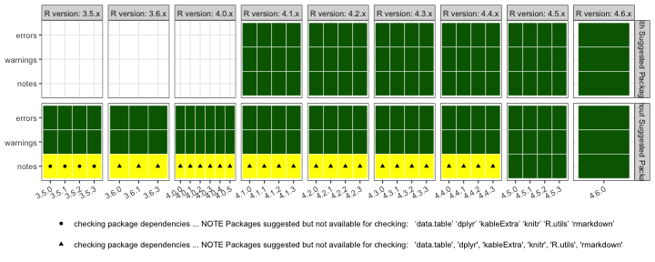

<!-- README.md is generated from README.Rmd. Please edit that file -->

# Testing medicalcoder

Along with GitHub Actions and local tests, the workflow in this directory will
test a recent local build of `medicalcoder` against every major and minor
release of R from 3.5.0 through the latest version, with, and without, suggested
packages.  The tests are done in [Docker](https://www.docker.com/) images based
on the [R-base](https://hub.docker.com/_/r-base) images.

## System Requirements:
To run the tests you need

* [Docker Desktop](https://www.docker.com/products/docker-desktop/)
* [GNU Make](https://www.gnu.org/software/make/)

Just run `make` from this directory.

**NOTE:** When something goes wrong and you need to dig into a specific image
run from this directory.

    docker run -v .:/work/ -it <image>

# Last Testing Results

The green tiles indicate no notes, no warning, no error.

